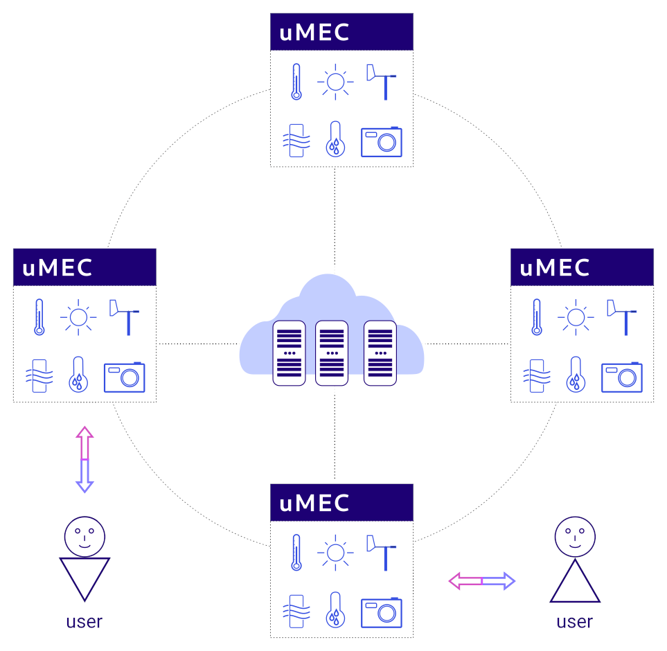
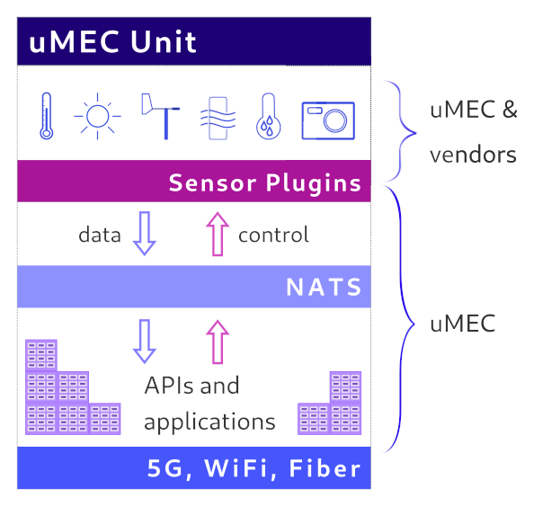
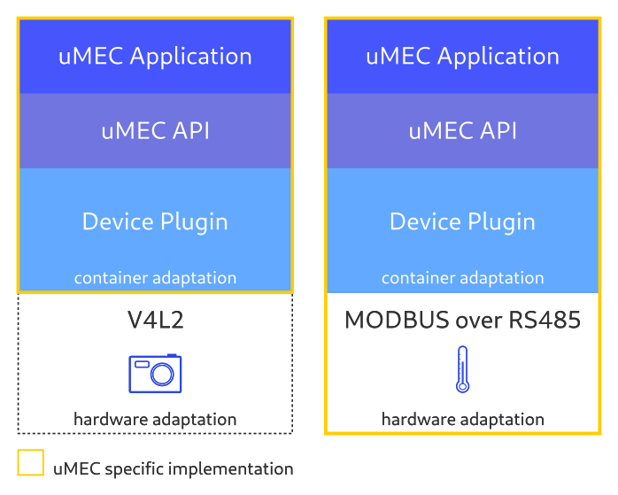
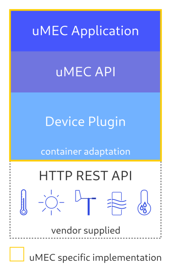

# MicroMEC Architecture

## Overview

In a network topology uMECs reside on the far edge, or ultra far edge. 
Physically the uMEC devices or units are typically installed on light poles, 
buildings or in moving vehicles. 

uMECs are connected to an existing IP network. This specification will not go 
into details on how to design such networks, but it assumes a working IP network
is available. 

As uMECs can also access cloud services from the Internet if the network 
operator who manages the installation allows such connections. 

## MicroMEC Unit

The diagram below presents the a basic uMEC Unit that includes hardware and 
software elements. The uMEC Unit is typically installed close to the data 
sources (sensors, cameras etc.). 

Integration to data sources are done in cooperation with the hardware vendors. 

Below we will outline each major block of the architecture.

### Sensor Plugins

Data source vendors may provide access to high level APIs (e.g. REST, ONVIF) or 
lower level protocols (Modbus, I2C, SPI etc.) over physical layers such as 
RS-485, RS-232, Ethernet etc. 

For integration purposes uMEC has a plugin system: Sensor Plugins. 

uMEC has two kinds of plugins based on their implementation methods:

* low level plugins
* high level plugins

#### Low Level Plugins

A low level plugin either connects to a kernel API that is running on the uMEC 
unit, or connects directly to the hardware via some physical connection.

Low level plugins may include two layers: 

* hardware adaptation
* container adaptation

Hardware adaptation can be implemented as a Linux kernel module, or can be 
built on top of existing APIs, such as V4L2 (Video for Linux). 

The container adaptation is a piece of software that let's a containerized 
application access the hardware that is physically attached to the uMEC unit. 

The container adaptation block is also responsible to relay data between 
NATS (see below) and the hardware adaptation layer. 

In some cases the hardware adaptation layer can be omitted. When an underlying 
protocol already exposes the hardware in a standardized way then the container
adaptation layer may directly use that protocol (such as USB cameras and V4L2).

##### Examples

The diagram above shows how low level plugins are implemented in context with 
the uMEC APIs and applications. 

On the left there is a camera plugin based on V4L2. There is no need for any 
hardware adaptation.

On the right side there is a temperature sensor (and a control unit) where the
hardware adaptation is an implementation of a MODBUS protocol specified by the 
vendor.

Both plugins have a device plugin as a container adaptation layer. The uMEC APIs
communicate with the specific sensor or camera via device plugins.

#### High Level Plugins

A high level plugin is needed when the vendor has abstracted the access to the 
sensor by providing an API. Such APIs can be based on HTTP, RTSP, or other IP 
based protocols. 

High level plugins only require container adaptation, which allows the uMEC APIs
to fetch data from the sensor, or send control commands to the sensor. In some
cases the uMEC APIs could implement the vendor APIs, without creating an extra 
software element. 

##### Example

The diagram outlines a high level device plugin. In this scenario the vendor 
provides a comprehensive HTTP REST API to communicate to a complex hardware, 
like a weather station.

The uMEC implementation only includes container adaptation. The vendor's API is
implemented and opened up for the relevant uMEC APIs for further use. The uMEC
API code could actually implement the vendor supplied API. There could be cases 
where an additional software component is more appropriate for the vendor API 
implementation in order to guarantee a cleaner architecture. Hence the picture 
separates the uMEC API from the container adaptation layer. 

### NATS

{todo}

### APIs and Applications

{todo}

### Network Connections

{todo}
