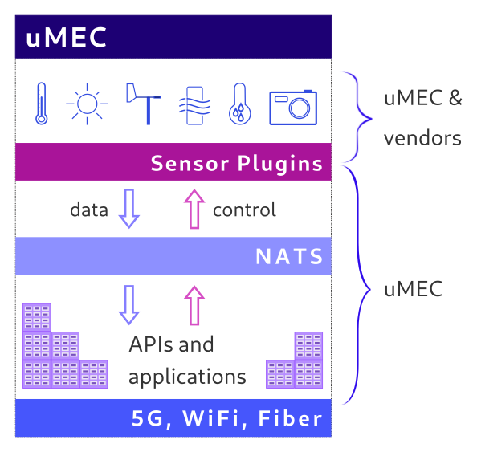
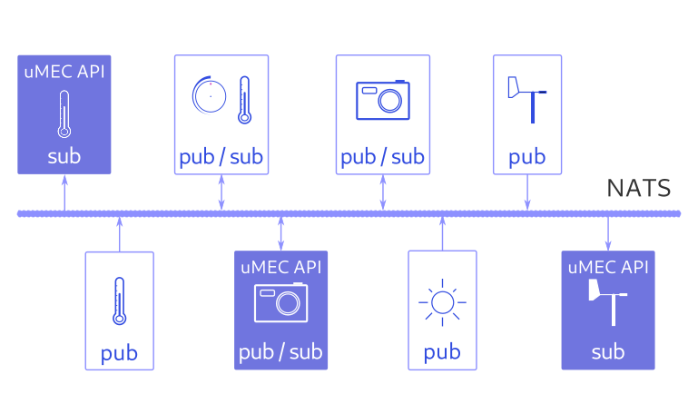

# MicroMEC Architecture

## Overview

In a network topology uMEC nodes reside on the far edge, or ultra far edge. 
Physically the **uMEC nodes** (in short uMECs) are typically installed on light 
poles, buildings or in moving vehicles. 

uMECs are connected to an existing IP network. This specification will not go 
into details on how to design such networks, but it assumes a working IP network
is available. 

uMECs can also access cloud services from the Internet if the network operator 
who manages the installation allows such connections. 

In a typical installation there are more uMECs connected to each other and 
forming a **cluster**. Each uMEC node may have access to different systems, 
sensors, cameras etc. 

Managing a cluster is non trivial without using a proper orchestration platform 
and an alerting / monitoring system. 

The [installation document](../installation/umec_installation.md) describes how 
these clusters can be built and configured.

## MicroMEC Node

The diagram below presents a basic uMEC node that includes hardware and software
elements. The uMEC is typically installed close to the data sources 
(sensors, cameras etc.) and to the systems to be controlled. 

Integration to such data sources and systems are done in cooperation with the 
hardware vendors. 

Below we will outline each major block of the architecture.

### Sensor Plugins

Data source vendors may provide access to high level APIs (e.g. REST, ONVIF) or 
lower level protocols (Modbus, I2C, SPI etc.) over physical layers such as 
RS-485, RS-232, Ethernet etc. 

For integration purposes uMEC has a plugin system called **Sensor Plugins**. 

uMEC has two kinds of plugins based on their implementation:

* low level plugins
* high level plugins

#### Low Level Plugins

A low level plugin either connects to a kernel API that is running on the uMEC 
node or connects directly to the hardware via some physical connection.

Low level plugins may include **two layers**: 

* hardware adaptation
* container adaptation

Hardware adaptation can be implemented as a Linux kernel module, or can be 
built on top of existing APIs, such as V4L2 (Video for Linux). 

The container adaptation is a piece of software that let's a containerized 
application access the hardware that is physically attached to the uMEC node. 

The container adaptation block is also responsible to relay data between 
NATS (see below) and the hardware adaptation layer. 

In some cases the hardware adaptation layer can be omitted. When an underlying 
protocol already exposes the hardware in a standardized way then the container
adaptation layer may directly use that protocol (such as USB cameras and V4L2).

##### Examples

The diagram above shows how low level plugins are implemented in context with 
the **uMEC APIs** and **uMEC applications**. 

On the left there is a camera plugin based on V4L2. There is no need for any 
hardware adaptation.

On the right side there is a temperature sensor (and a control unit) where the
hardware adaptation is an implementation of a MODBUS protocol specified by the 
vendor.

Both plugins have a device plugin as a container adaptation layer. The uMEC APIs
communicate with the specific sensor or camera via device plugins.

#### High Level Plugins

A high level plugin is needed when the vendor has abstracted the access to the 
sensor by providing an API. Such APIs can be based on HTTP, RTSP, or other IP 
based protocols. 

High level plugins only require container adaptation, which allows the uMEC APIs
to fetch data from the sensor, or send control commands to the sensor. In some
cases the uMEC APIs could implement the vendor APIs, without creating an extra 
software element. 

##### Example

The diagram outlines a high level device plugin. In this scenario the vendor 
provides a comprehensive HTTP REST API to communicate to a complex hardware, 
like a weather station.

The uMEC implementation only includes container adaptation. The vendor's API is
implemented and opened up for the relevant uMEC APIs for further use. 

The uMEC API code could actually implement the vendor supplied API. There could 
be cases where an additional software component is more appropriate for the 
vendor API implementation in order to guarantee a cleaner architecture. 

The picture above separates the uMEC API from the container adaptation layer. 

### NATS

[NATS.io](https://nats.io) allows secure, multi-tenant messaging between the 
Sensor Plugins and the uMEC APIs. 

The diagram above shows various *users* of NATS. There are sensor plugins that 
only **publish** information. Other sensor devices may be able to receive 
control commands, hence they also **subscribe** to messages coming from uMEC 
APIs. uMEC APIs can also have dual roles, so they can subscribe as well as 
publish information. 

With built in mechanisms NATS guarantees that data is secured and properly
isolated from various *users*. Accounts are created for each sensor plugin and 
uMEC API implementations. Each party is authenticated to limit access to data. 
Messages are encrypted and signed to ensure security and data integrity.

#### NATS Cluster

It is possible to setup clustering for NATS when multiple uMEC nodes are 
connected to the same network. This feature allows easy data sharing among uMEC
nodes and enables use cases that involve moving objects, such as vehicles, for 
example. 

### APIs and Applications

As mentioned earlier the APIs provided by uMEC as well as the applications that 
make use of these APIs are all containerized. Containers are orchestrated with 
[k3s](https://k3s.io). 

APIs are connecting to the sensors via plugins to send commands and receive 
data. 

Applications interact with the APIs, they do not have direct access to the 
plugins. Strict authentication and authorization measures are taken to ensure 
proper access control overall uMEC.

### Network Connections

uMEC nodes are connected to an IP network. 

It must be kept in mind that uMEC nodes form clusters. If there is a distributed 
network spanning across a larger area, then the design and implementation should 
allow the uMECs to communicate with each other. 

Such cluster could be realized in a street where each light pole is equipped 
with uMEC and the light poles are connected to the same LAN.

Interesting use cases arise when a guest joins such a static network. A guest 
could be a person with a suitable IP device, or a moving vehicle. These devices
can become part of the same LAN and maximize the usage of the uMEC cluster. 

This document is not meant to describe such scenarios in detail.

