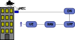

# MicroMEC Architecture

## Introduction

This architecture document starts with the a general introduction to µMEC and its use cases. It then describes the components it uses and their roles. It also covers the plans in meeting the requirements for the platform.

This is a living document in that it tries to track the changes in the architecture and our aim is to keep it up to date.

## Overview

In a network topology uMEC nodes reside on the far edge, or ultra far edge.  Physically the **uMEC nodes** (in short uMECs) are typically installed on light poles, buildings or in moving vehicles. 

uMECs are connected to an existing IP network. This specification will not go into details on how to design such networks, but it assumes a working IP network is available. 

uMECs can also access cloud services from the Internet if the network operator who manages the installation allows such connections. 

In a typical installation there are more uMECs connected to each other and forming a **cluster**. Each uMEC node may have access to different systems, sensors, cameras etc. 

Managing a cluster is non trivial without using a proper orchestration platform and an alerting / monitoring system. 

The [installation document](../installation/umec_installation.md) describes how these clusters can be built and configured.

 

In terms of 5G architecture, the µMEC (despite the name) is connected to the Data Network (DN, usually Internet) through the User Plane Function (UPF). Obviously, it can share physical connectivity with a base station, but logically it is separate, as shown in the diagram.

## MicroMEC Node

The diagram below presents a basic uMEC node that includes hardware and software elements. The uMEC is typically installed close to the data sources (sensors, cameras etc.) and to the systems to be controlled. 

Integration to such data sources and systems are done in cooperation with the hardware vendors. 

Below we will outline each major block of the architecture.

### Sensor Plugins

Data source vendors may provide access to high level APIs (e.g. REST, ONVIF) or lower level protocols (Modbus, I2C, SPI etc.) over physical layers such as RS-485, RS-232, Ethernet etc. 

For integration purposes uMEC has a plugin system called **Sensor Plugins**. 

uMEC has two kinds of plugins based on their implementation:

* low level plugins
* high level plugins

#### Low Level Plugins

A low level plugin either connects to a kernel API that is running on the uMEC node or connects directly to the hardware via some physical connection.

Low level plugins may include **two layers**: 

* hardware adaptation
* container adaptation

Hardware adaptation can be implemented as a Linux kernel module, or can be built on top of existing APIs, such as V4L2 (Video for Linux). 

The container adaptation is a piece of software that let's a containerized application access the hardware that is physically attached to the uMEC node. 

The container adaptation block is also responsible to relay data between NATS (see below) and the hardware adaptation layer. 

In some cases the hardware adaptation layer can be omitted. When an underlying protocol already exposes the hardware in a standardized way then the container adaptation layer may directly use that protocol (such as USB cameras and V4L2).

##### Examples

The diagram above shows how low level plugins are implemented in context with the **uMEC APIs** and **uMEC applications**. 

On the left there is a camera plugin based on V4L2. There is no need for any hardware adaptation.

On the right side there is a temperature sensor (and a control unit) where the hardware adaptation is an implementation of a MODBUS protocol specified by the vendor.

Both plugins have a device plugin as a container adaptation layer. The uMEC APIs communicate with the specific sensor or camera via device plugins.

#### High Level Plugins

A high level plugin is needed when the vendor has abstracted the access to the sensor by providing an API. Such APIs can be based on HTTP, RTSP, or other IP based protocols. 

High level plugins only require container adaptation, which allows the uMEC APIs to fetch data from the sensor, or send control commands to the sensor. In some cases the uMEC APIs could implement the vendor APIs, without creating an extra software element. 

##### Example

The diagram outlines a high level device plugin. In this scenario the vendor 
provides a comprehensive HTTP REST API to communicate to a complex hardware, 
like a weather station.

The uMEC implementation only includes container adaptation. The vendor's API is
implemented and opened up for the relevant uMEC APIs for further use. 

The uMEC API code could actually implement the vendor supplied API. There could 
be cases where an additional software component is more appropriate for the 
vendor API implementation in order to guarantee a cleaner architecture. 

The picture above separates the uMEC API from the container adaptation layer. 

### NATS

[NATS.io](https://nats.io) allows secure, multi-tenant messaging between the Sensor Plugins and the uMEC APIs. 

The diagram above shows various *users* of NATS. There are sensor plugins that only **publish** information. Other sensor devices may be able to receive control commands, hence they also **subscribe** to messages coming from uMEC APIs. uMEC APIs can also have dual roles, so they can subscribe as well as publish information. 

With built in mechanisms NATS guarantees that data is secured and properly isolated from various *users*. Accounts are created for each sensor plugin and uMEC API implementations. Each party is authenticated to limit access to data.  Messages are encrypted and signed to ensure security and data integrity.

#### NATS Cluster

It is possible to setup clustering for NATS when multiple uMEC nodes are connected to the same network. This feature allows easy data sharing among uMEC nodes and enables use cases that involve moving objects, such as vehicles, for 
example. 

### APIs and Applications

As mentioned earlier the APIs provided by uMEC as well as the applications that 
make use of these APIs are all containerized. Containers are orchestrated with 
[k3s](https://k3s.io). 

APIs are connecting to the sensors via plugins to send commands and receive data. 

Applications interact with the APIs, they do not have direct access to the plugins. Strict authentication and authorization measures are taken to ensure proper access control overall uMEC.

### Network Connections

uMEC nodes are connected to an IP network. 

It must be kept in mind that uMEC nodes form clusters. If there is a distributed network spanning across a larger area, then the design and implementation should allow the uMECs to communicate with each other. 

Such cluster could be realized in a street where each light pole is equipped with uMEC and the light poles are connected to the same LAN.

Interesting use cases arise when a guest joins such a static network. A guest could be a person with a suitable IP device, or a moving vehicle. These devices
can become part of the same LAN and maximize the usage of the uMEC cluster. 

This document is not meant to describe such scenarios in detail.

# Implementation stack

The µMEC software stack has several components and for each there are different alternatives. 

Here are some of the concerns for the µMEC that the µMEC software stack must address:

Linux operating system distribution with support for containers
----------------------------------------------------------------

The µMEC hardware must have an operating system with support for containers. This is because the third-party applications that the µMEC supports are deployed as containers, which have the benefit of being independent of the operating system distribution. The operating system distribution is needed for hardware support and for providing all necessary packages, some of which may not be known at the time of this writing.

µMEC lifecycle management
-------------------------

The µMEC must commissioned when it starts up. This should happen automatically so that when it starts, it will find its configuration and install the necessary software. It also must be kept up to date with the latest firmware and operating system components.

Tools such as Ansible or Salt can be used for lifecycle management.

Application management
----------------------

The MEC applications must be copied to the µMECs according to some rules. The ETSI MEC is working on this.

Application configuration 
--------------------------

The applications must be launched at the µMEC with suitable permissions from the operating system. A big part of the application configuration is the networking configuration, so that the application components will receive IP addresses and will be registered to a local DNS server. The application configuration can also include MTTQ configuration if they use it.

Application interfaces
-----------------------

The applications will both use interfaces and provide them. For this, they use the API Framework. The APIs available include the services that the platform provides and the sensors available. Applications can also use services provided by other services if that is allowed.

User management, authentication, authorization
----------------------------------------------

The µMEC will have different levels of users with varying permissions: some users will be allowed to update the software platform and some will manage their applications. It must be possible to authenticate the users and authorize them to do maintenance operations. The most likely mechanism for this is configuring ssh keys for authentication, with no password access.

Data management
----------------

The data the the µMEC applications generate must be moved out of the box to be useful. The µMEC must support the different mechanisms to connect to outside systems.

Operating System 
=================

The operating system includes, besides the Linux system to get the hardware to do something, also mechanisms to keep the system up-to-date with the latest security patches. Related to this are also the boot system and the boot trust system.

Boot
-----

The video by Alexander Graf, SUSE on Marrying U-Boot, uEFI and grub2 (https://youtu.be/qJAkJ3nmWgM) is a good introduction to the topic. The default way to boot ARM-based systems is using U-Boot. The U-Boot supports uEFI that in turn provides a standard execution enironment for operating system bootloaders. 

### uEFI ###

UEFI provides a standardized interface to board firmware. It is a standard with different implementations. It allows eg filesystem support in operating system, and from the Linux distro point of view it allows a uniform image.

The reference implementation for uEFI is Tianocore. It has good support for different Intel boards, being an Intel project, but the support for ARM processors is quite limited. (https://github.com/tianocore/tianocore.github.io/wiki/EDK-II-Platforms). 

### U-Boot ###

Das U-Boot had the first releases already in 2002 and seems to be still actively maintained, with the 2019.01 release in the works. 

The U-Boot can be chainloaded with other bootloaders. 

https://www.denx.de/wiki/U-Boot

### ARM Trusted Firmware (ATF) ###
http://infocenter.arm.com/help/topic/com.arm.doc.den0021d/DEN0021D_Trusted_Base_System_Architecture_Client.pdf

Virtual infrastructure layer
=============================

The key components in the virtual infrastructure layer are

- OCI: Established in June 2015 by Docker and other leaders in the container industry, the OCI currently contains two specifications: the Runtime Specification (runtime-spec) and the Image Specification (image-spec). The Runtime Specification outlines how to run a “filesystem bundle” that is unpacked on disk. At a high-level an OCI implementation would download an OCI Image then unpack that image into an OCI Runtime filesystem bundle. At this point the OCI Runtime Bundle would be run by an OCI Runtime.

- containerd:   containerd is an industry-standard core container runtime with an emphasis on simplicity, robustness and portability. It is available as a daemon for Linux and Windows, which can manage the complete container lifecycle of its host system: image transfer and storage, container execution and supervision, low-level storage and network attachments, etc..  containerd includes a daemon exposing gRPC API over a local UNIX socket. The API is a low-level one designed for higher layers to wrap and extend. It also includes a barebone CLI (ctr) designed specifically for development and debugging purpose. It uses runC to run containers according to the OCI specification.

- runc: runc is a component of containerd, the executor for containers. containerd has a wider scope than just executing containers: downloading container images, managing storage and network interfaces, calling runc with the right parameters to run container 

- CRI-O:  CRI-O [#cri-o] is an implementation of the Kubernetes CRI (Container Runtime Interface) to enable using OCI (Open Container Initiative) compatible runtimes. It is a lightweight alternative to using Docker as the runtime for kubernetes. It allows Kubernetes to use any OCI-compliant runtime as the container runtime for running pods. Today it supports runc and Clear Containers as the container runtimes but any OCI-conformant runtime can be plugged in principle.

   CRI-O supports OCI container images and can pull from any container registry. It is a lightweight alternative to using Docker, Moby or rkt as the runtime for Kubernetes.

- Podman: Podman (https://podman.io) is a replacement for the dockerd daemon which implements the same API as Docker. The containers still run using runc. It is fully supported on Fedora/CentOS but has to be compiled and installed on Ubuntu.  Links: https://github.com/containers/libpod/blob/master/docs/tutorials/podman_tutorial.md, https://developers.redhat.com/blog/2019/02/21/podman-and-buildah-for-docker-users/. 

- k3s: k3s is a small Kubernetes-compatible distribution, especially for small devices.

Device management
=================

We will use the Salt stack for configuring the devices. Here are instructions on setting up the Salt master to managedevices:

    sudo docker pull saltstack/salt
    sudo docker run --name salt --hostname salt -P -e SALT_SHARED_SECRET=mysecretpassword -d saltstack/salt
    sudo docker exec salt "ls /srv/salt/"

In the code, this is implemented in `device_manager` directory. The Salt Stack has two modes of operation, one is the Master-Minion mode, and the other is the "salt-ssh" mode. The Master-Minion mode uses ZeroMQ for communication, so it requires some configuration to be operational. And the purpose is to configure the devices.

ETSI MEC APIs
==============

ETSI MEC defines APIs using the OpenAPI (https://openapis.org) version 2. All the published APIs are in https://forge.etsi.org/rep/mec.

The API is defined in a Yaml file, and there are generators for different programming languagues in https://openapi-generator.tech. Therefore, the recommended workflow is to 

1. Download the ETSI API
2. Generate documentation and skeleton code
3. Implement the server based on the skeleton code

Security architecture
======================

The overview article [Khan2017] lists many of the security requirements: 

1. Image signing and origin verification
2. Vulnerability assessment, patching and remmediation strategy
3. Reducing the attack surface
4. Secrets management store
5. Access control for containers
6. Identity federation
7. Container profiling
8. Network isolation

References
=======================

IoT device management

https://www.i-scoop.eu/internet-of-things-guide/iot-device-management/
https://www.edgexfoundry.org/blog/2017/10/25/edgex-arm64-support/

FIWARE

https://github.com/FIWARE-TMForum/Business-API-Ecosystem

References
==================

[#cri-o] https://cri-o.io or https://github.com/kubernetes-sigs/cri-o

[Khan2017]: Key characteristics of a Container Orchestration Platform to Enable a Modern Application. IEEE Cloud Computing, September/October 2017. 
