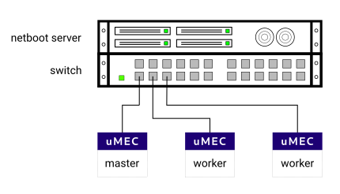

# MicroMEC Installation

# Introduction

The installation on the preferred hardware is done by booting the system over 
network. The preferred hardware for a uMEC node is a Raspberry Pi (3B+ or 4B). 

There are instructions on [how to prepare a MicroMEC cluster for network boot](./umec_netboot.md).

In a netboot setup the uMEC nodes load the Linux kernel image and initramfs via 
TFTP from the netboot server. The root file system of each node is a separate 
iscsi target on the netboot server. The uMEC nodes login to the iscsi target 
during boot up. 

Upgrading a uMEC node can be done simply by replacing the kernel or changing the
root file system on the boot server and rebooting the uMEC node.

The MicroMEC [upstream documentation is available online](https://github.com/MicroMEC/documentation).

# License

Apache license

# Deployment Architecture

We are currently deploying a 3 node system with the installation.

## Pre-Installation Requirements

The boot server must have the TFTP/BOOTP server and NFS server installed. For 
more details please refer to the [MicroMEC Netboot](./umec_netboot.md) document.

# Hardware Requirements

## Minimum Hardware Requirements

Raspberry Pi 3B+

## Recommended Hardware Requirements

Raspberry Pi 4B

# Software Prerequisites

## Database Prerequisites

None

## Jump Host Requirements

In the simplest setup the jump host to the uMEC cluster is the netboot server 
itself. Requirements of that are defined in the [MicroMEC Netboot](./umec_netboot.md) 
document.

## Network Requirements

The network must allow all messages needed for the network boot to happen. 
For instance, the client is not able to send VLAN-tagged traffic when it boots. 
Notice also that dhcp relaying is not reliable, so it is best if the client and 
server are connected to the same switch or have a direct connection.

# Installation High-Level Overview

## Bare Metal Deployment Guide

As above.

## Virtual Deployment Guide

Booting the image with a virtual machine is not supported. However, a virtual 
machine image (Vagrant file) is under construction.
           
## Validation

The setup must be validated as defined by the Akraino validation feature project 
plus any additional testing specific to the blue print.

It should be possible to connect to the system with normal kubernetes commands. 
See k3s documentation.

## Uninstallation Guide
 
The uMEC nodes do not store any data. All data is kept on the netboot server, or
on the server that hosts the root filesystem (iscsi target). Decommissioning the
netboot server means a uMEC cluster can no longer start. 
