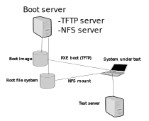

# MicroMEC Installation

# Introduction

The installation on the preferred hardware (Raspberry Pis) is done simply by booting the system over network.

    License

    Deployment Architecture

    Pre-Installation Requirements

        Hardware Requirements

            Minimum Hardware Requirements

            Recommended Hardware Requirements

        Software Prerequisites

        Database Prerequisites

            Schema scripts

        Other Installation Requirements

            Jump Host Requirements

            Network Requirements

            Bare Metal Node Requirements

            Execution Requirements (Bare Metal Only)

       Installation High-Level Overview

        Bare Metal Deployment Guide

            Install Bare Metal Jump Host

            Creating a Node Inventory File

            Creating the Settings Files

            Running

        Virtual Deployment Guide

            Standard Deployment Overview

            Snapshot Deployment Overview

            Special Requirements for Virtual Deployments

                Install Jump Host

                Verifying the Setup - VMs

        Upstream Deployment Guide

            Upstream Deployment Key Features

            Special Requirements for Upstream Deployments

            Scenarios and Deploy Settings for Upstream Deployments

            Including Upstream Patches with Deployment

            Running

            Interacting with Containerized Overcloud

    Verifying the Setup as defined the Akraino validation feature project plus any additional testing specific to the blue print

    Developer Guide and Troubleshooting

        Utilization of Images

        Post-deployment Configuration

        Debugging Failures

        Reporting a Bug

    Uninstall Guide

    Troubleshooting

        Error Message Guide

    Maintenance

        Blue Print Package Maintenance
            Software maintenance
            Hardware maintenance
        Blue Print Deployment Maintenance

    Frequently Asked Questions

    License

    References

    Definitions, acronyms and abbreviations

